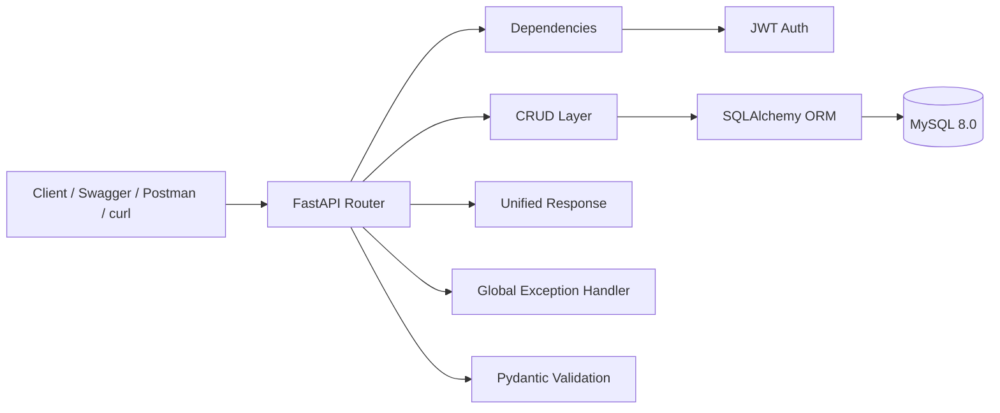
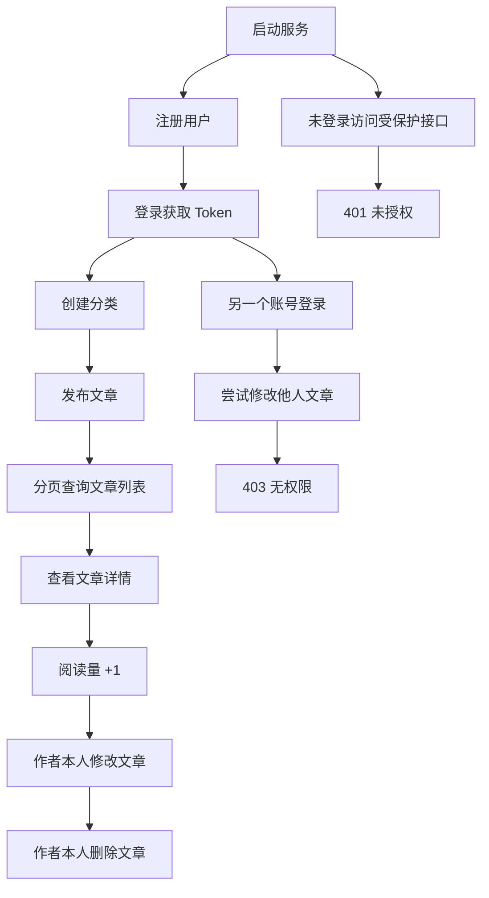

# FastAPI Personal Blog API System

[](https://www.python.org/)
[](https://fastapi.tiangolo.com/)
[](https://www.mysql.com/)
[](https://www.sqlalchemy.org/)
[](https://jwt.io/)
[](./LICENSE)

> 一个适合大二学生用于课程作业、后端练手和大厂后端实习面试展示的 FastAPI 个人博客接口项目。

## 项目简介

这是一个基于 `FastAPI + MySQL + SQLAlchemy + JWT` 的个人博客后端接口系统，围绕后端开发中最常见的能力进行完整实现：

- 用户注册、登录、JWT 权限认证
- 文章增删改查、作者权限控制
- 分类管理与文章绑定
- 分页查询、分类筛选、阅读量统计
- 参数校验、统一返回格式、全局异常处理
- 自动生成 Swagger / ReDoc 接口文档

这个项目不只是“能跑通几个接口”，而是尽量按真实后端项目的工程化方式组织代码，更适合拿来展示你的后端基础和项目完成度。

## 项目亮点

- 面向实习面试场景，覆盖登录鉴权、权限拦截、CRUD、分页、异常处理等高频考点
- 目录分层清晰，便于后续扩展评论、标签、上传、缓存等模块
- 使用 JWT 做接口保护，未登录和越权场景都有明确拦截
- 使用 Pydantic 做请求参数校验，错误提示统一且友好
- 统一 `code / msg / data` 返回结构，接口风格规范
- 支持 Swagger 文档直接演示完整业务链路

## 快速入口

- 在线仓库: [GitHub Repository](https://github.com/ZuoXing-0504/FastAPI-Personal-Blog-API-System)
- 接口测试文档: [docs/API_TESTING.md](./docs/API_TESTING.md)
- Postman 集合: [docs/FastAPI-Personal-Blog.postman_collection.json](./docs/FastAPI-Personal-Blog.postman_collection.json)
- 开源协议: [LICENSE](./LICENSE)

## 技术栈

- Python 3.9+
- FastAPI
- MySQL 8.0
- SQLAlchemy ORM
- PyJWT
- Pydantic
- Passlib
- PyMySQL
- CORS Middleware

## 功能清单

### 用户模块

- 用户注册
- 用户登录
- 密码加密存储
- JWT 令牌签发与校验
- 获取当前登录用户信息
- 未登录接口权限拦截

### 文章模块

- 发布文章
- 查看文章列表
- 分页查询
- 按分类筛选
- 查看文章详情
- 阅读量自动加 1
- 修改文章
- 删除文章
- 仅作者本人可修改或删除

### 分类模块

- 创建分类
- 查询分类列表
- 发布文章时绑定分类

### 通用能力

- 统一返回格式
- 全局异常处理
- 自动请求参数校验
- 自动生成接口文档
- CORS 跨域支持

## 架构概览



## 演示流程图



## 统一返回格式

所有接口统一返回如下结构：

```json
{
  "code": 200,
  "msg": "操作成功",
  "data": {}
}
```

分页接口返回示例：

```json
{
  "code": 200,
  "msg": "查询文章列表成功",
  "data": {
    "items": [],
    "total": 0,
    "page": 1,
    "page_size": 10,
    "total_pages": 0
  }
}
```

## 项目目录结构

```text
FastAPI-Personal-Blog-API-System
├─ app
│  ├─ api
│  │  ├─ deps.py
│  │  └─ v1
│  │     ├─ api.py
│  │     └─ endpoints
│  │        ├─ auth.py
│  │        ├─ users.py
│  │        ├─ categories.py
│  │        └─ articles.py
│  ├─ core
│  │  ├─ config.py
│  │  ├─ response.py
│  │  └─ security.py
│  ├─ crud
│  │  ├─ user.py
│  │  ├─ category.py
│  │  └─ article.py
│  ├─ db
│  │  ├─ base.py
│  │  └─ database.py
│  ├─ exceptions
│  │  ├─ custom.py
│  │  └─ handlers.py
│  ├─ models
│  │  ├─ user.py
│  │  ├─ category.py
│  │  └─ article.py
│  ├─ schemas
│  │  ├─ common.py
│  │  ├─ user.py
│  │  ├─ auth.py
│  │  ├─ category.py
│  │  └─ article.py
│  └─ main.py
├─ docs
│  ├─ API_TESTING.md
│  └─ FastAPI-Personal-Blog.postman_collection.json
├─ sql
│  └─ blog_schema.sql
├─ .env.example
├─ .gitignore
├─ LICENSE
├─ main.py
├─ README.md
└─ requirements.txt
```

## 数据库设计

项目核心包含三张表：

- `users`: 用户表
- `categories`: 分类表
- `articles`: 文章表

关系说明：

- 一个用户可以发布多篇文章
- 一篇文章只能属于一个分类
- 删除用户时，其文章会级联删除

建表 SQL 位于：

```text
sql/blog_schema.sql
```

## 本地启动

### 1. 克隆项目

```bash
git clone https://github.com/ZuoXing-0504/FastAPI-Personal-Blog-API-System.git
cd FastAPI-Personal-Blog-API-System
```

### 2. 创建并激活虚拟环境

```bash
python -m venv .venv
```

Windows:

```bash
.venv\Scripts\activate
```

Linux / macOS:

```bash
source .venv/bin/activate
```

### 3. 安装依赖

```bash
pip install -r requirements.txt
```

### 4. 配置环境变量

复制 `.env.example` 为 `.env`，并修改数据库连接信息：

Windows:

```bash
copy .env.example .env
```

Linux / macOS:

```bash
cp .env.example .env
```

推荐配置示例：

```env
MYSQL_HOST=127.0.0.1
MYSQL_PORT=3306
MYSQL_USER=root
MYSQL_PASSWORD=123456
MYSQL_DB=fastapi_blog

JWT_SECRET_KEY=replace-with-a-secure-secret
JWT_ALGORITHM=HS256
ACCESS_TOKEN_EXPIRE_MINUTES=120
```

### 5. 初始化数据库

请先确保本地已安装并启动 MySQL 8，然后执行：

```bash
mysql -uroot -p123456 < sql/blog_schema.sql
```

### 6. 启动服务

```bash
uvicorn main:app --host 127.0.0.1 --port 8000 --reload
```

启动成功后可访问：

- Swagger UI: `http://127.0.0.1:8000/docs`
- ReDoc: `http://127.0.0.1:8000/redoc`
- Health Check: `http://127.0.0.1:8000/health`

## 主要接口

### 用户接口

- `POST /api/v1/auth/register`: 用户注册
- `POST /api/v1/auth/login`: 用户登录
- `GET /api/v1/users/me`: 获取当前登录用户

### 分类接口

- `POST /api/v1/categories`: 创建分类
- `GET /api/v1/categories`: 查询分类列表

### 文章接口

- `POST /api/v1/articles`: 发布文章
- `GET /api/v1/articles`: 分页查询文章列表
- `GET /api/v1/articles/{article_id}`: 查询文章详情
- `PUT /api/v1/articles/{article_id}`: 修改文章
- `DELETE /api/v1/articles/{article_id}`: 删除文章

## 接口测试说明

如果你想直接照着文档完成整套演示流程，可以看：

- [curl 接口测试文档](./docs/API_TESTING.md)
- [Postman Collection](./docs/FastAPI-Personal-Blog.postman_collection.json)

这两份文档覆盖了：

- 注册、登录、获取 token
- 创建分类
- 发布文章
- 分页查询文章列表
- 查询文章详情
- 修改和删除自己的文章
- 未登录访问受保护接口
- 使用另一个账号验证越权失败

## 面试演示 Checklist

- 启动服务并打开 Swagger 文档
- 注册用户并登录获取 Token
- 点击 Swagger 右上角 `Authorize`，填入 `Bearer <token>`
- 创建分类
- 发布文章
- 分页查询文章列表并按分类筛选
- 查看文章详情并确认阅读量加 1
- 修改自己的文章
- 删除自己的文章
- 使用另一个账号尝试修改该文章并验证返回 403
- 未登录访问受保护接口并验证返回 401

## 简历描述示例

你可以这样写这个项目：

> 基于 FastAPI、MySQL、SQLAlchemy 和 JWT 独立完成个人博客后端接口系统开发，实现用户注册登录、文章与分类管理、权限控制、统一异常处理、参数校验、分页查询与阅读量统计，并通过 Swagger 自动生成接口文档，支持完整的接口演示与测试。

## 后续可扩展方向

- 评论模块
- 标签模块
- 文件上传
- 富文本编辑器支持
- Redis 缓存
- Docker 部署
- 单元测试 / 接口测试
- CI/CD 自动化部署

## License

本项目使用 [MIT License](./LICENSE) 开源，适合学习、二次开发和个人作品展示。
